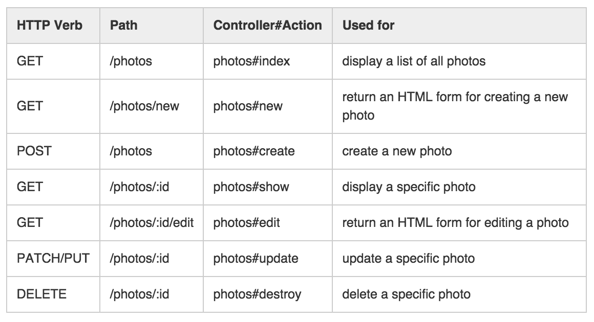

<h1>DBC Phase 2 Reference Sheet:<br/>
ReSTful Routes for Sinatra</h1>

<h4>Prepared by Jeff George for future DBC students<br/>
Based on the Phase 2 Helper Sheet compiled by Ryan Lesson</h4>

## Restful Routes for Sinatra Apps


### Routes Template
```ruby
get '/things' do
  @things = Thing.all
  @errors = params[:errors]
  erb :"/things/index"
end

get '/things/new' do
  @errors = params[:errors]
  erb :"/things/new"
end

get '/things/:id' do
  @thing = Thing.find_by(id: params[:id])
  @user = @thing.user
  @errors = params[:errors]
  erb :"/things/show"
end

post "/things" do
  thing = Thing.new(params[:thing])
  thing.user = current_user
  if thing.save
    redirect "/things/#{thing.id}"
  else
    errors = thing.errors.full_messages
    redirect "/things/new?errors=#{errors}"
  end
end

get '/things/:id/edit' do
  @thing = Thing.find_by(id: params[:id])
  @errors = params[:errors]
  erb :"/things/edit"
end

put '/things/:id' do
  thing = Thing.find_by(id: params[:id])
  if thing.update_attribute(params[:thing])
    redirect "/things/#{thing.id}"
  else
    errors = thing.errors.full_messages
    redirect "/things/#{thing.id}/edit?errors=#{errors}"
  end
end

delete "/things/:id" do
  Thing.find_by(id: params[:id]).destroy
  redirect "/users/#{current_user.id}"
end
```

### Sending requests to routes from HTML
#### GET Requests
**GET** requests receive views as the server response, such as indexes and forms. In Sinatra, the server renders an **erb** file to produce the HTML string it provides as a view. GET requests lead to the #index, #new, and #show routes. GET requests may be triggered with links to the route:

```html
<a href="/things/new">Create a new thing</a>
```

#### POST Requests
All other requests (POST, PUT/PATCH, DELETE) are handled in HTML as POST requests using forms. These always send data to the server, along with instructions (through the route in the controller) of what to do with the data when it arrives (usually to create, update, or delete a record in the database). As a response, they generally receive a **redirect** guiding the client to immediately issue a GET request for a new view.

**POST** requests begin the #create routes. Unless AJAX is implemented in the site, the POST form is often placed on its own page.

```html
<form method="POST" action="/things" >
  <label for="thing-name">Name:</label>
  <input id="thing-name" type="text" name="thing[name]" required />
  <label for="thing-description">Description:</label>
  <textarea id="thing-description" name="thing[description]" required></textarea>
  <input type="submit" value="Save Thing" />
</form>
```

**PUT/PATCH** requests handle #edit routes. They begin in HTML as POST forms with a special, **hidden** input field. Like normal POST forms, PUT and PATCH forms are often put on their own page on simple, non-AJAXed websites.

```html
<form method="POST" action="/things/<%= @thing.id %>" >
  <input type="hidden" name="_method" value="PUT" />
  <label for="thing-name">Name of the thing:</label>
  <input id="thing-name" type="text" name="thing[name]" value="<%= @thing.name %>" required />
  <label for="thing-description">Description of the thing:</label>
  <textarea id="thing-description" name="thing[description]" required><%= @thing.description %></textarea>
  <input type="submit" value="Save Changes" />
</form>
```

**DELETE** routes are also handled in HTML with forms that have a hidden field. Because there is nothing to enter in a delete form aside from the target object's id, the form usually appears as a simple button on an #index or #show view, near the object to be deleted.

```html
<form method="POST" action="/things/<%= @thing.id %>">
  <input type=hidden name="_method" value="DELETE">
  <input type="submit" value="Delete Thing">
</form>
```
